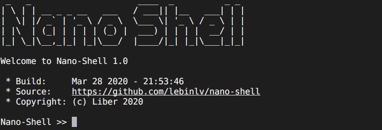
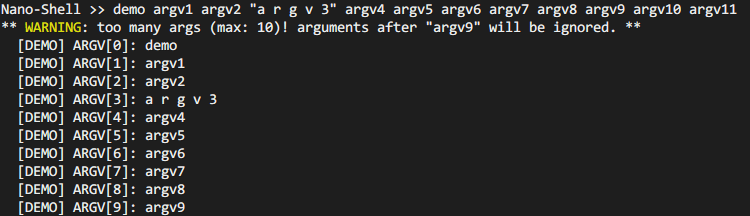

# Nano-Shell



- [Nano-Shell](#nano-shell)
  - [Hot Key Bind](#hot-key-bind)
  - [Add Command](#add-command)
    - [Simple example:](#simple-example)
  - [Configuring](#configuring)
    - [readline configurations:](#readline-configurations)
    - [command configurations:](#command-configurations)
    - [shell configurations:](#shell-configurations)
    - [shell io configurations:](#shell-io-configurations)
  - [Porting nano-shell to your project](#porting-nano-shell-to-your-project)


Nano-Shell is a light but powerful shell designed for embedded systems.

- with or without an operating system;
- `<main loop mode>` or `<react mode>`;
- highly configurable;
- powerful: command line editing, history record, multi-line input, hot key bind, etc...
- memory friendly: **NO** malloc and free;
- light (build with arm-none-eabi-gcc 7.3.1 20180622, -O3):
  |                              | .text<sup>(1)</sup>  | .rodata | .bss<sup>(2)</sup> | .data |
  |:------------------------------------------:|:------:|:-------:|:-----:|:-----:|
  | main loop mode,<br/>all configurations on  | 2.5KB  | 1.03KB  | 852B  | 8B    |
  | main loop mode,<br/>all configurations off<sup>(3)</sup> | 616B   | 600B    | 180B  | 0B    |
  | react mode,<br/>all configurations on      | 2.52KB | 1.03KB  | 852B  | 8B    |
  | react mode,<br/>all configurations off<sup>(3)</sup>     | 608KB  | 600B    | 180B  | 0B    |

  > 1: include build in `help` command.<br/>
  > 2: include `input buffer`(default 128Bytes) and `hisroty record buffer`(defaut 5*(128+2)Bytes) <br/>
  > 3: except `CONFIG_SHELL_CMD_BUILTIN_HELP`.


## Hot Key Bind

nano-shell has internally bound these hotkeys:

| HOT KEY | ASCII/ANSI-Escape Code<br/>(Xterm, VT100) | Function |
|---------|------------------------|----------|
| Ctrl A | 1 | Home<br/>Move curosr to the start of line.|
| Ctrl E | 5 | End<br/>Move curosr to the end of line.|
| Ctrl P | 16 | Up arrow(-->)<br/>Move cursor right one char.|
| Ctrl N | 14 | Down arrow(-->)<br/>Move cursor right one char.|
| Ctrl B | 2 | Left arrow(<--)<br/>Move cursor left one char.|
| Ctrl F | 6 | Right arrow(-->)<br/>Move cursor right one char.|
| Ctrl D | 4 | Delete<br/>Delete the character under the cursor.|
| Ctrl K | 11 | Erase forward<br/>Clears all characters from the cursor position to the end of the line.|
| Ctrl U | 21 | Erase backword<br/>Clears all characters from the cursor position to the start of the line..|
| Ctrl C | 3  | Kill the line.|
| Home        | Esc[H  | Move curosr to the beginning of line.|
| End         | Esc[F  | Move curosr to the end of line.|
| Up Arrow    | Esc[A  | Get the previous history. |
| Down Arrow  | Esc[B  | Get the next history. |
| Left Arrow  | Esc[D  | Left arrow(<--)<br/>Move cursor left one char.  |
| Right Arrow | Esc[C  | Right arrow(-->)<br/>Move cursor right one char.|
| Delete      | Esc[3~ | Delete the character under the cursor.|

## Add Command

Commands are added to nano-shell by creating a new command structure.

This is done by first including `command/command.h`, then using the `NANO_SHELL_ADD_CMD()` macro to fill in a `shell_cmd_t` struct.

``` c
NANO_SHELL_ADD_CMD(_name, _func, _brief, _help)
```
`_name`: name of the command. Note: **THIS IS NOT** a string.

`_func`: function pointer: (*cmd)(const shell_cmd_t *, int, int, char *const[]).

`_brief`: brief summaries of the command. This is a string.

`_help`: detailed help information of the command. This is a string.


### Simple example:
```c
int _do_demo(const shell_cmd_t *pcmd, int argc, char *const argv[])
{
  for (int i=0; i<argc; i++) {
    shell_printf("  [DEMO] ARGV[%d]: %s\r\n", i, argv[i]);
  }
  return 0;
}

NANO_SHELL_ADD_CMD(demo,
                   _do_demo,
                   "a command demo",
                   "  It's detailed help information of demo command\r\n");
```
Run `demo` in terminal:



Run `help` and `help demo` in terminal:


## Configuring

@file: [`shell_config.h`](/shell_config.h)

### readline configurations:

- CONFIG_SHELL_INPUT_BUFFSIZE (127U)
  - default value: `(127U)`
  - command line input buffer size (in byte).

- CONFIG_SHELL_LINE_EDITING
  - default: 1(enabled)
  - set this to `0` will disable command line editing.

- CONFIG_SHELL_KEY_SEQ_BIND
  - default: 1(enabled)
  - set this to `0` will disable ANSI-Escape-Sequence. nano-shell will not be able to detect Home/End/Delete/Arrow keys. Doesn't affect Ctrl-P, Ctrl-N, etc...

- CONFIG_SHELL_MULTI_LINE
  - default: 1(enabled)
  - use Backslash('\\') for line continuation when enabled, set this to `0` will disable line continuation.

- CONFIG_SHELL_HIST_MIN_RECORD
  - default value: `(5U)`
  - set this to `0` will disable history record.
  - nano-shell will take `CONFIG_SHELL_HIST_MIN_RECORD*(2+CONFIG_SHELL_INPUT_BUFFSIZE)` bytes to record **at least** `CONFIG_SHELL_HIST_MIN_RECORD` histroys. The max history records depends on the average length of the input.

### command configurations:

- CONFIG_SHELL_CMD_BRIEF_USAGE
  - default: 1(enabled)
  - command structure `shell_cmd_t` has a pointer point to "brief usage information of the command", set this to `0` will remove it.

- CONFIG_SHELL_CMD_LONG_HELP
  - default: 1(enabled)
  - command structure `shell_cmd_t` has a pointer point to "detailed help information of the command", set this to `0` will remove it.

- CONFIG_SHELL_CMD_BUILTIN_HELP
  - default: 1(enabled)
  - nano-shell provides a built-in `help` command, set this to `0` will remove the deault `help` command.

- CONFIG_SHELL_CMD_MAX_ARGC
  - default: `(10U)`
  - config the max number of arguments, must be no less than 1.

### shell configurations:

- CONFIG_SHELL_PROMPT
  - default: `"Nano-Shell >> "`
  - config the shell promot that will displayed at the start of line. If you don't need it, set this to `NULL` or `""`.


### shell io configurations:

- CONFIG_SHELL_PRINTF_BUFFER_SIZE 128U
  - default: `(128U)`
  - config the buffer size of shell_printf().


## Porting nano-shell to your project

### 1. add nano-shell root path to your project include path. <!-- omit in toc -->

### 2. implement these functions([`@file shell_io.h`](/shell_io/shell_io.h)) in your project: <!-- omit in toc -->

this file may help: [`/shell_io/shell_io.c`](/shell_io/shell_io.c).
```c
/**
* @brief send a chararcter...
*
*/
extern void shell_putc(char ch);


/**
* @brief send string...
*
*/
extern void shell_puts(const char *str);


/**
 * @brief printf() for nano-shell
 *
 */
extern int shell_printf(const char *format, ...) __attribute__((format(printf, 1, 2)));


/**
 * @brief: Get next character available from stream.
 *
 * @param ch: Return the character in `ch` if there was...
 * @return: Result is non-zero if there was a character, or 0 if there wasn't.
 *
 */
extern int shell_getc(char *ch);
```

Note:
- `int shell_getc(char *ch)` is **NOT USED** in `<react mode>`
- If you run nano-shell in `<main loop mode>`, to avoid losing characters, you'd better use a low layer receive fifo.

  Take uart for example, you can detect incoming data using interrupts and then store each received character in a first-in-first-out (FIFO) buffer:
  ```c
  void your_uart_interrupt_handler(void)
  {
    /* your uart receive code */
    char ch = uart_get_char();

    /* store character in fifo */
    fifo_push(ch);
  }
  ```

  then `shell_getc(char *ch)` may be:
  ```c
  int shell_getc(char *ch)
  {
    if (fifo_empty()) {  // if no character in fifo,
      return 0;          // return false
    }

    *ch = fifo_pop();  // fifo is not empty, get a character from fifo.
    return 1;          // return true
  }
  ```

### 3. then modify the configuration file: [`shell_config.h`](/shell_config.h) <!-- omit in toc -->

### 4. according to your system, you can: <!-- omit in toc -->

#### 4.1 without os, main loop mode: <!-- omit in toc -->
  ```c
  #include "nano_shell.h"

  int main(void)
  {
    /* system init code... */

    /* nano-shell infinite loop. */
    nano_shell_loop(NULL);
  }
  ```

#### 4.2 without os, react mode(non-block): <!-- omit in toc -->
  for example:
  ```c
  void your_interrupt_handler (void) // such as uart receive interrupt handler
  {
    /* your uart receive code */
    char ch = uart_get_char();

    /* nano-shell isr interface */
    nano_shell_react(ch);
  }
  ```

Note:
- `nano_shell_react()` is non-blocked (unless there was an infinite loop in your command function), you can call it when get a new character.
- ~~It is recommended to disable some configurations in `shell_config.h` if it was called in interrupt.~~

#### 4.3 with os, take freertos for example: <!-- omit in toc -->
  ```c
  #include "nano_shell.h"

  int main(void)
  {
    /* system init code... */

    /* create nano_shell task */
    TaskHandle_t shellTaskHandle = NULL;
    xTaskCreate(nano_shell_loop, "shellTask", <stack_size>, NULL,
                <task_priority>, &shellTaskHandle);

    /* start rtos task scheduler */
    vTaskStartScheduler();
  }
  ```

Note:
- When determining the stack size for nano-shell, you should consider the memory occupied by commands added in nano-shell.

### 5. define nano_shell section in your linker script file: <!-- omit in toc -->

add these 5 lines to your linker script file:
```ld
.nano_shell : {
  . = ALIGN(4);
  KEEP (*(SORT(.nano_shell*)))
  . = ALIGN(4);
 } >FLASH
```

### 6. build, flash and try it. <!-- omit in toc -->
